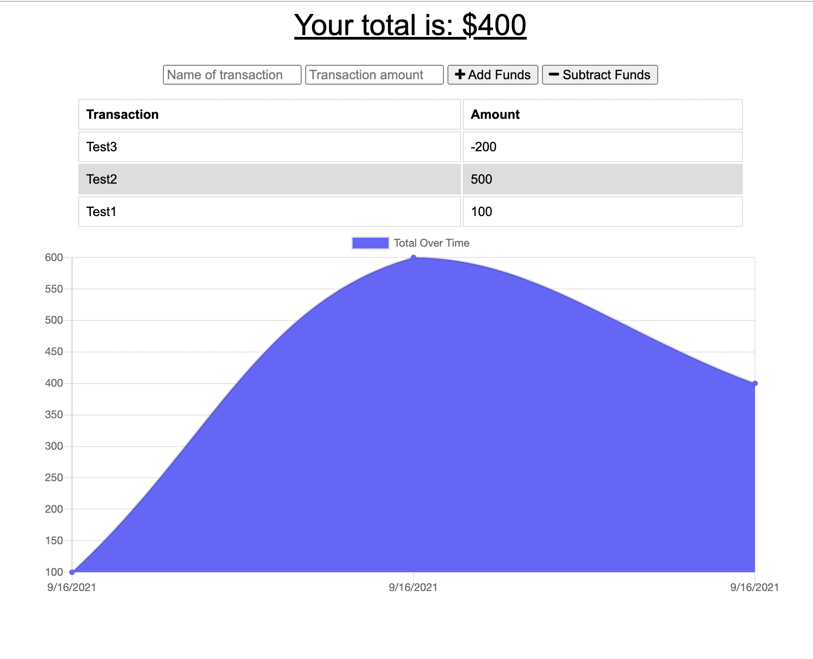

# Budget Tracker

## Table of Contents:

* [Description](#description)
* [Link](#link)
* [Screen Shot](#screen-shot)
* [Packages](#packages)

## Description
Helps user to keep a track expenses, additional featured expense tabled and chart for better UI experience. This app is also available for offline use.

## Link
Click [HERE](https://fierce-beach-31361.herokuapp.com/) to open the app

## Screen Shot

    
## Packages
- [Express](https://expressjs.com/)
- [Mongoose](https://www.npmjs.com/package/mongoose)

## Thank You
### Author Details
**Name:** Sonali Pandey

**GitHub:** [sonali-pandey](https://github.com/sonali-pandey)

